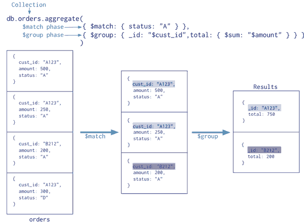

## node 操作 mysql 的原理是什么？ 

node-mysql 是用纯 JS 实现的 MySQL 驱动（也有其他用 C/C++ Addon 实现的），优势是兼容性好，安装时不需要编译，但可能稳定性和性能不如 libmysql 的实现（毕竟是官方的）。
至于实现细节，显然你应该去看 MySQL 的通讯协议标准 https://dev.mysql.com/doc/internals/en/client-server-protocol.html

   
node-mysql 实现了 mysql 的协议，就这么简单

https://github.com/felixge/faster-than-c


## 怎样在Node.js中实现Sleep的功能？

最近在研究用Node.js做网络爬虫，在爬一个网站的时候，通过测试发现它有一个限制，如果持续爬它超过100个网络链接的时候，它就会限制你访问，过一段时间（5分钟左右）才让你访问。我想实现一个功能，如果访问达到90个链接的时候，程序暂停一会（1分钟左右），然后继续访问，就相当于其他语言中的Sleep功能（不要告诉我用循环，这个方法CPU都被它占用了）。在Node.js这种异步环境下，有没有比较好的方法实现Sleep这样的功能？


答曰：setTimeout, 可以考虑结合 async.forever 使用


## why-i-am-switching-to-promises

http://spion.github.io/posts/why-i-am-switching-to-promises.html


## 使用config来管理配置文件

https://github.com/lorenwest/node-config

下面是一个比较简单的weixin公众号api配置的实例

执行命令：

```
npm install --save config
touch config/default.json
```
配置config/default.json内容

```
  "wx": {
    "app_id": "wx04014b02a0",
    "app_secret": "cc4c224b5018370cf6ffc95",
    "wx_menu": {
      "button": [
        {
          "name": "xxxxx",
          "sub_button": [
            {
              "type": "view",
              "name": "xxxxx",
              "url": "http://www.xxxxx.com/"
            },
 
```

实际调用代码

```
var API = require('wechat-api');
var config = require('config');

var menu_config = config.get('wx.wx_menu');
var app_id      = config.get('wx.app_id');
var app_secret  = config.get('wx.app_secret');

var api = new API(app_id, app_secret);

//测试
function app(){
  api.createMenu(menu_config, function(err, result){
    console.log(result);
  });
}

module.exports = app;
```

上面是比较常见的，还有像数据库配置啊等等


最佳实践应该是

- 敏感信息放到环境变量里
- 不敏感的配置信息放到config.json里

更好的一点是config支持各种模式

- production
- developmeng
- test 
- staging

比如production模式下，config目录下创建config/production.json就可以了，真是太方便了。

注意json要格式化，最好的办法是

```
[sudo] npm install -g je
je
```

把json放里面格式化去


## mongodb聚合运算

MongoDB的聚合框架原理如下图：使用$match类似SQL的where语句，查询所有文档字段status是"A"的文档，$group是将相同id为"A123"的元素合并，合并后的字段名是total，值是根据{ $sum: "$amount"  }来计算，{ $sum表示计算总和。
    


more http://www.jdon.com/repository/aggregate-data-from-mongodb.html